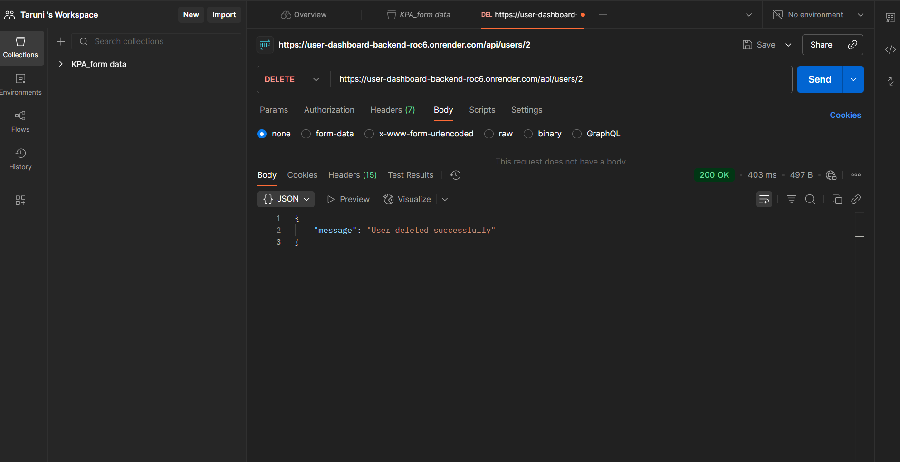

# User Management REST API

A backend REST API to manage users with CRUD operations (Create, Read, Update, Delete).
Built using **Node.js** + **Express** and connected to a **SQLite database**.
 ---

## Folder Structure
backend/
├── routes/
│   └── users.js
├── database.js
├── server.js
├── package.json
├── package-lock.json
├── .gitignore
└── users.db

---

## Live Deployment

[The backend API is live at:
https://user-dashboard-backend-roc6.onrender.com/]

---

## API Endpoints
### Backend Running

- Here’s the screenshot showing the backend running on Render and returning all users from /api/users:

()

### 1. Get All Users
- URL: /api/users
- Method: GET
- Live Example: All Users
Response Example:
[
    {
        "id": 1,
        "name": "Eleven",
        "email": "eleven@example.com",
        "phone": "9876543210",
        "company": "Hawkins Labs",
        "street": "Maple Street",
        "city": "Hawkins",
        "zipcode": "123456",
        "lat": "40.7128",
        "lng": "-74.0060"
    },
    {
        "id": 2,
        "name": "Mike Wheeler",
        "email": "mikewheeler@example.com",
        "phone": "9123456780",
        "company": "Hawkins High School",
        "street": "Oak Avenue",
        "city": "Hawkins",
        "zipcode": "123457",
        "lat": "40.7130",
        "lng": "-74.0058"
    }
]

Screenshot Placeholder:
()

### 2. Get Single User

- URL: /api/users/:id
- Method: GET
- Example:
GET https://user-dashboard-backend-roc6.onrender.com/api/users/1

Response Example:

{
   "id": 1,
    "name": "Eleven",
    "email": "eleven@example.com",
    "phone": "9876543210",
    "company": "Hawkins Labs",
    "street": "Maple Street",
    "city": "Hawkins",
    "zipcode": "123456",
    "lat": "40.7128",
    "lng": "-74.0060"
}

Screenshot Placeholder:
()

### 3. Create a New User

- URL: /api/users
- Method: POST
- Request Body (JSON):
{
    "name": "Dustin Henderson",
    "email": "dustin@example.com",
    "phone": "9234567890",
    "company": "Hawkins High School",
    "street": "Pine Road",
    "city": "Hawkins",
    "zipcode": "123458",
    "lat": "40.7125",
    "lng": "-74.0065"
}

Response Example:

{
  "message": "User created successfully",
  "id": 3
}

Screenshot Placeholder:
()

### 4. Update a User

- URL: /api/users/:id
- Method: PUT
- Request Body (JSON):
{
    "name": "Dustin Henderson Updated",
    "email": "dustin@example.com",
    "phone": "9234567890",
    "company": "Hawkins High School",
    "street": "Pine Road",
    "city": "Hawkins",
    "zipcode": "123458",
    "lat": "40.7125",
    "lng": "-74.0065"
}

Response Example:
{
  "message": "User updated successfully"
}

Screenshot Placeholder:
()

### 5. Delete a User

- URL: /api/users/:id
- Method: DELETE
- Response Example:
{
  "message": "User deleted successfully"
}

Screenshot Placeholder:
()

---

## Notes

- Address fields are stored as separate columns (street, city, zipcode, lat, lng) in SQLite.

- CORS is enabled for frontend integration.

- Proper HTTP status codes and validations are implemented.

---

## .env.example
- PORT=8081
